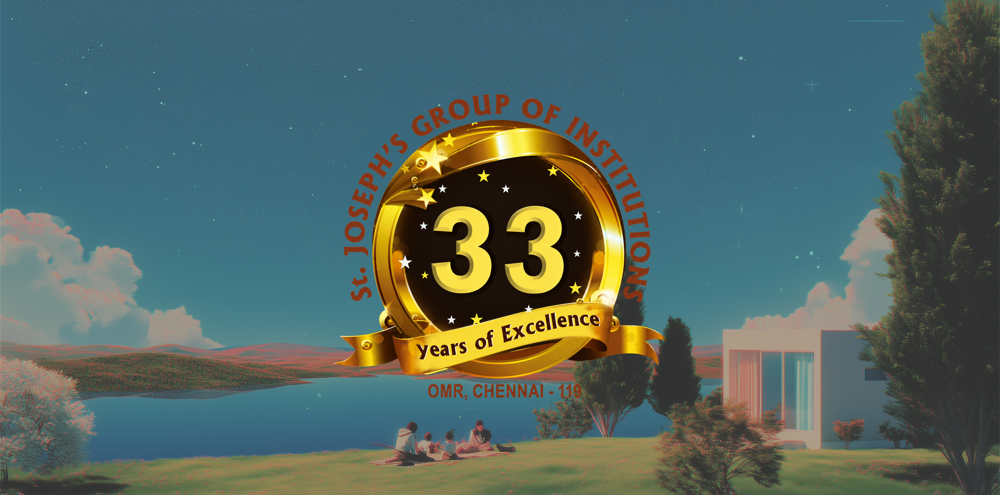

<p align="center">
  
</p>

<p align="center">
  <strong>St. Joseph's Placements and Training Cell Documentation</strong>
</p>

<p align="center">
  Documentation for St. Joseph's Placements and Training Cell's learning management platform.
</p>

---

## Local Development

This site lives in the [`learnhouse-stjosephs`](https://github.com/Shreesh-Sree/learnhouse-stjosephs)
repository under `docs/`. Run all commands from that directory.

**Prerequisites:** [Bun](https://bun.sh) installed.

```bash
# Clone the repository and move into the docs app
git clone https://github.com/Shreesh-Sree/learnhouse-stjosephs.git
cd learnhouse-stjosephs/docs

# Install dependencies
bun install

# Start the dev server
bun dev
```

The site will be available at `http://localhost:3000`.

## Project Structure

```
content/          # MDX documentation pages
  getting-started/
  platform/
  self-hosting/
  developers/
  enterprise/
  cli/
app/              # Next.js App Router
components/       # React components
public/           # Static assets
scripts/          # Build scripts
```

## Built With

- [Next.js](https://nextjs.org)
- [Nextra](https://nextra.site)
- [Tailwind CSS](https://tailwindcss.com)

## License

MIT - see [LICENSE](LICENSE) for details.
